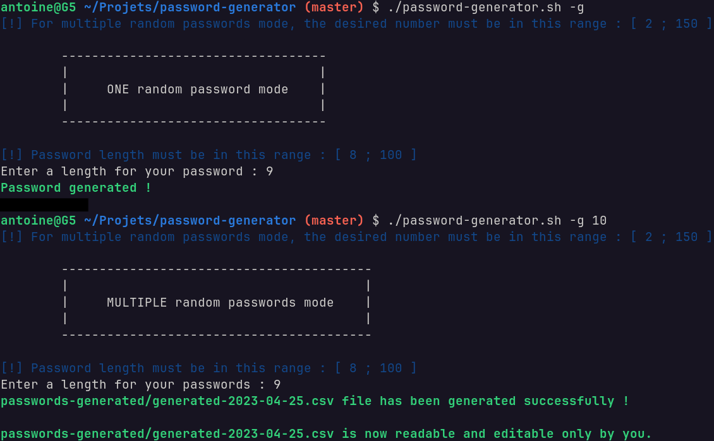

# password-generator

Script which generates one or multiple random passwords.

In the multiple random passwords mode, passwords generated are stored in a protected .csv file readable and writable only by you.

The password must contain, at least, one uppercase letter, one lowercase letter, one number and one special character.

- If you don't know a specific length for your future password, 15 is recommended to have a strong and complex password.

## Need some help ?

```
-g
    • generate a random password with the length ∈ [ 8 ; 100 ] chose by the user
-g <number_passwords_to_generate>
    • generate multiple random passwords with the desired number ∈ [ 2 ; 150 ] and the length ∈ [ 8 ; 100 ] chose by the user
-h
    • help 
```

## Example of use



## References

- https://owasp.org/www-community/password-special-characters  
- https://en.wikipedia.org/wiki/Password_strength  
- https://www.quora.com/What-is-the-best-password-length 
